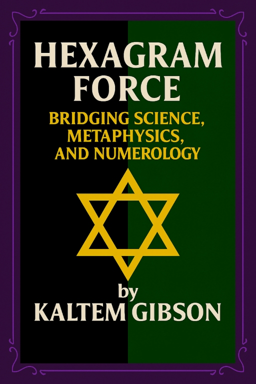
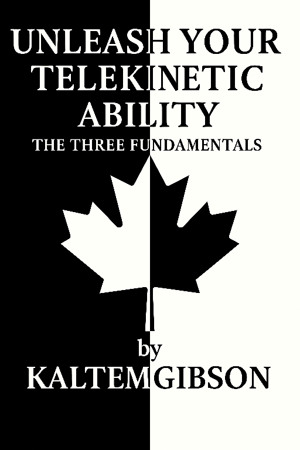

Copyright © 2025 by Kaltem M. Gibson. All Rights Reserved.

---

Author Portfolio

This page provides verification details for my published works.

Each entry includes only the essential identifiers for cross-reference.

---

All ebooks listed on this page are my original works and are protected under copyright law.

This portfolio is provided for verification purposes only and is not intended for retail distribution.

---

## 📖 Hexagram Force: Bridging Science, Metaphysics, and Numerology.

**Author:** Kaltem Gibson 
**ISBN:** 978-1-0696591-0-1

**Short Synopsis:**  

Hexagram Force unites four books into a single framework aimed at solving fundamental scientific questions:

- Nog – Explores force as a structured phenomenon expressed through geometry, magnetism, and natural patterns. It studies ancient sites (Stonehenge, Easter Island, etc) as evidence of advanced knowledge of force distribution. This section also lays the groundwork for a unified field theory connecting gravity, electromagnetism, and nuclear interactions.

- Quark – Demonstrates that planetary formation is not random but follows precise mathematical laws. Through repeated calculations, it shows correlations between tilt, size, and magnetic fields, offering proof of intentional design. It reexamines Einstein’s unfinished unified field theory, reveals hexagram configurations on gas giants, and connects astrological structures with planetary science.

- Rom – Challenges established constants, including reevaluating π as 3.15, and develops frameworks based on sacred geometry and biblical numerology. It interprets symbolic numbers such as 333 and 666 as force indicators, examines dark matter and dark energy, and highlights recurring constants such as 22.5° that appear across astronomy, ancient architecture, and natural cycles.

- Ishka – Extends the theory into human anatomy, showing that the body itself is constructed according to geometric laws and force principles. Joints and muscles all follow proportional systems described by various theories, proving that living systems embody the same universal structures as the cosmos.

Together, these volumes argue for a unified vision of force: one that redefines planetary science, offers solutions to the unified field theory and reveals a geometric order connecting the universe, the Earth, and the human body.

---

## 📖 Unleash Your Telekinetic Ability: The Three Fundamentals

**Author:** Kaltem Gibson 
**ISBN:** N/A

**Short Synopsis:**  

In *Unleash Your Telekinetic Ability: The Three Fundamentals*, this book will guide readers through the principles and exercises that help unlock the mind’s latent telekinetic potential. The book focuses on the practical application of mental techniques, emphasizing focus, energy, and force, and provides clear, step-by-step exercises to strengthen these abilities.  

**Key Highlights:**  

- **The Three Fundamentals:**  
  1. **Focus** – Techniques to sharpen mental concentration and direct attention with precision.  
  2. **Energy** – Methods to harness and channel personal mental energy effectively.  
  3. **Force** – Exercises to apply focused energy in practical telekinetic actions.

This book builds from foundational techniques to advanced application, helping readers grow at their own pace. This book has lessons designed to develop each fundamental, allowing readers to apply theory to practice.  

**Availability:**  
- This eBook is currently available through the author directly. Please contact me to request access or information about official editions.  

**Note:**  
- This eBook was originally published before ISBNs were assigned.  
- Unauthorized copies circulating online are not sanctioned by Kaltem Gibson.
